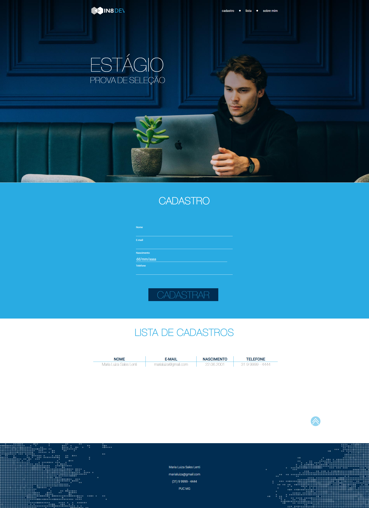
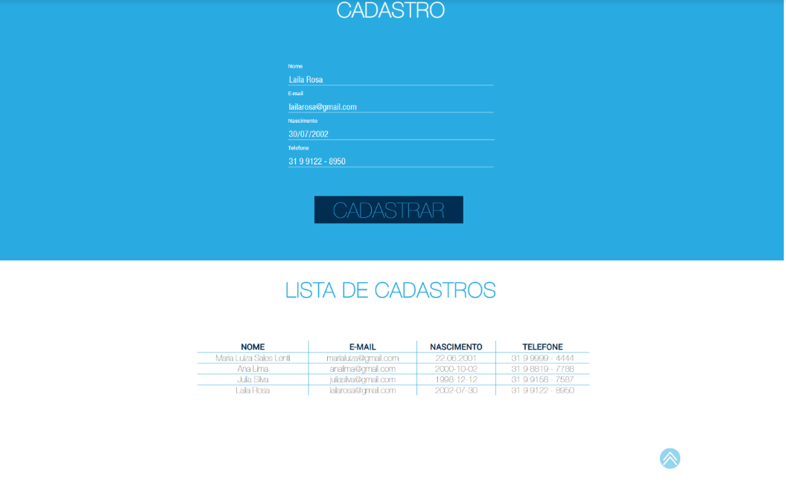
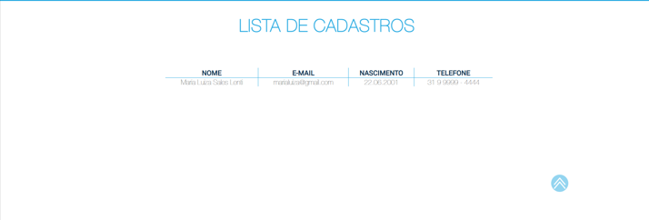

# ProvaFullStack
Prova processo seletivo da IN8 

<h1>TELAS:</h1>

<li>Desktop:</li>
 

 
<li>MOBILE:</li>
 

 
<li>Tablet:</li>
 

 

<h1>INSTRUÇÕES</h1>

<li>Cadastro: preencha todos os campos do formulário e clique em "cadastrar" para adicionar na tabela “Lista de Cadastros”.</li>
 

 
<li>Acesso menu mobile e tablet: clique no ícone das barras para acessar o menu, clique novamente para sair, ao clicar nas opções, o usuário será levado a sessão desejada.</li>
 

 
<li>Ícone seta para cima (versão desktop): ao clicar no ícone, o usuário será levado ao topo da página.</li>
 

   

